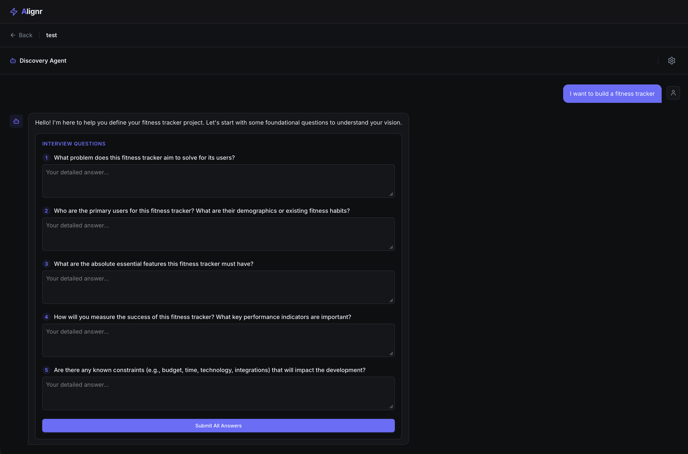
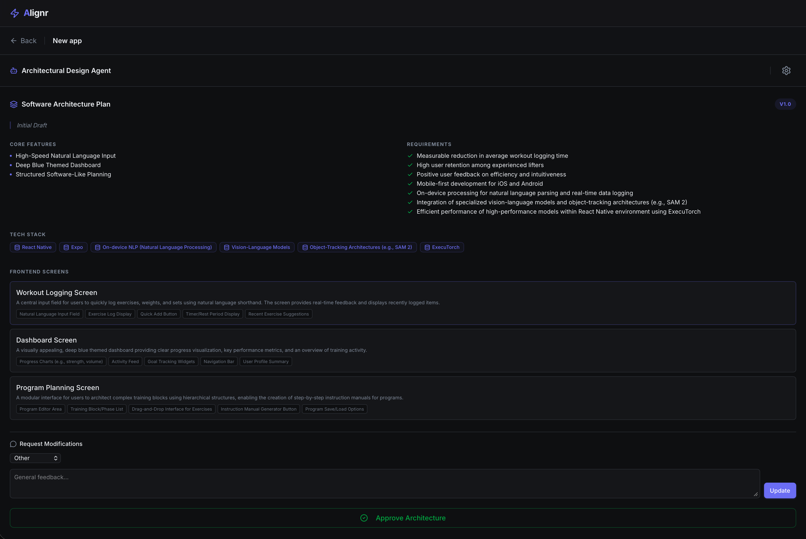
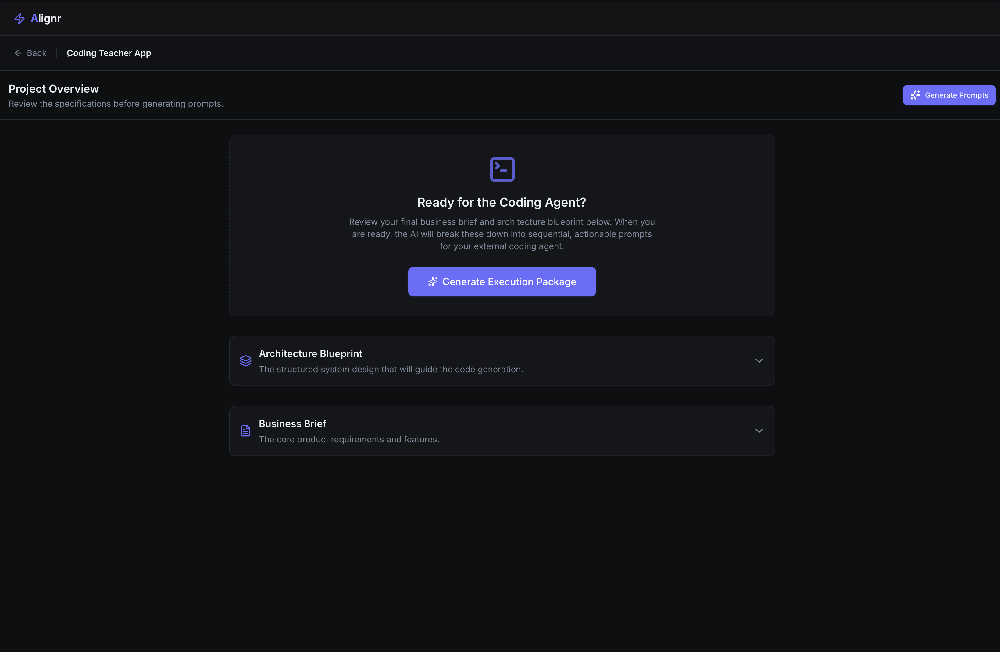
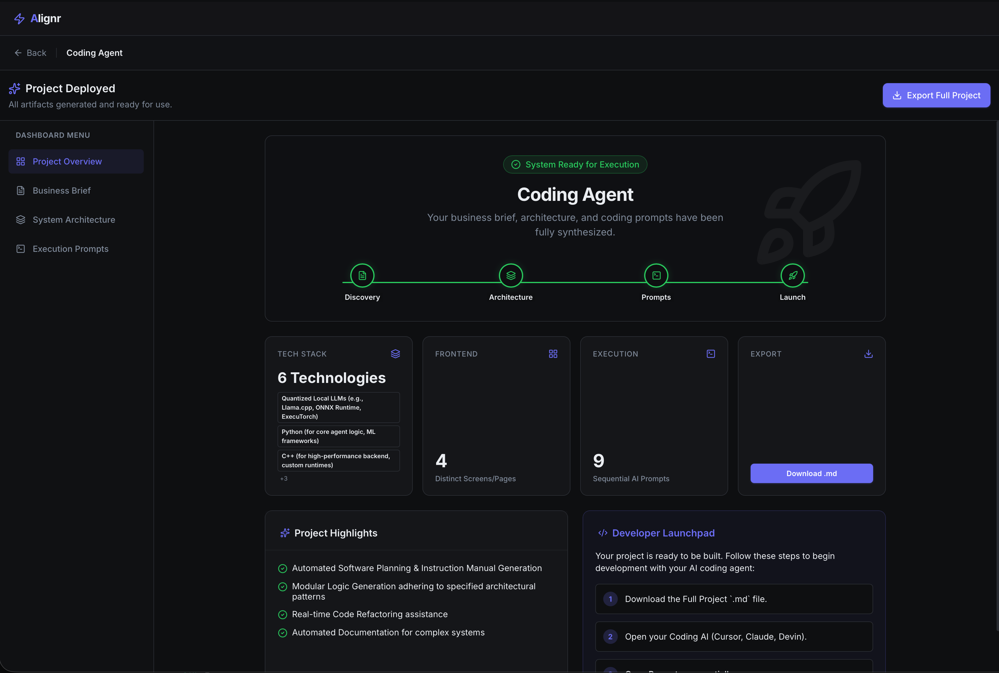

# Alignr ⚡️

**From Idea to Execution, Automated.**

Alignr is a multi-agent product development platform that acts as your autonomous product team. It takes your raw ideas and systematically refines them into production-ready execution packages. 

Instead of staring at a blank codebase, Alignr gives you a complete business brief, a structured system architecture, and a step-by-step roadmap so you can start building immediately.

|  |  |
| :---: | :---: |
| **Business Interview** | **Software Planner** |
|  |  |
| **Execution Package** | **Project Artifacts** |

## Why Alignr?

* **Specialized AI Agents:** Work with a dedicated team—a Business Analyst, a Software Planner, and an Execution Planner—each handling a specific phase of your product's lifecycle.
* **Developer-Ready Outputs:** Alignr generates sequential, actionable coding prompts perfectly structured to be dropped into AI coding tools.
* **The "Shared Brain":** As your project moves through the pipeline, all details are globally synced. Every agent stays perfectly aligned with your core vision from start to finish.
* **Frictionless Workflow:** Progress smoothly from a chaotic brainstorm directly to a highly structured tech stack and UI component breakdown.

## How It Works

1. **Discovery:** Start with a simple idea. The Business Analyst agent will interview you, flesh out your requirements, and generate a comprehensive Business Brief.
2. **Architecture:** The Software Planner synthesizes your brief into a robust blueprint, defining your features and frontend screen layouts.
3. **Execution:** The Execution Planner breaks down the architecture into bite-sized, sequential coding prompts and exact system requirements.
4. **Deploy:** Export your entire project and launch your development phase with absolute clarity.

## Core Features

* **Interactive Agent Chat:** Dynamic, context-aware conversations for each development stage.
* **Architecture Visualization:** Review, modify, and approve your system's design and UI screens before writing a single line of code.
* **Guest Mode:** Try the platform and generate project briefs instantly without needing an account.
* **One-Click Export:** Download your entire project as a clean Markdown file to share with your team or feed to your development environment.

---
*Built to bring order to the chaos of product development.*